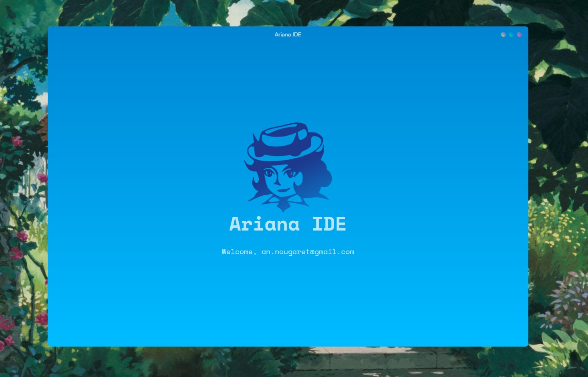

<p align="center">
  <h1 align="center">Ariana IDE</h1>
  
  <br />
  <p align="center"><i>The IDE of the future.</i></p>
  <div align="center">
    <a href="https://discord.gg/Y3TFTmE89g"></a>
    <a href="https://twitter.com/anic_dev"></a>
  </div>
</p>

## Features

The future doesn't wait for a feature list. It unfolds as every second passes.

## Installation

```bash
# Install globally via npm
npm install -g ariana

# Login and launch IDE
ariana
```

## Architecture

- **Backend**: Rust + Actix Web + SQLite
- **CLI**: Node.js with email-based authentication flow
- **Desktop App**: Tauri + React + Vite

## Project Structure

```
ariana/
├── backend/          # Rust backend server
│   ├── src/
│   │   ├── main.rs
│   │   ├── auth.rs
│   │   ├── database.rs
│   │   └── email.rs
│   └── Cargo.toml
├── frontend/         # Node.js CLI + Tauri app
│   ├── src/
│   │   └── cli.js    # Main CLI application
│   ├── tauri-app/    # Tauri desktop application
│   └── package.json
└── README.md
```

## Development

### Backend Setup

1. Navigate to the backend directory:
```bash
cd backend
```

2. Set up environment variables:
```bash
cp .env.example .env
# Edit .env with your email credentials
```

3. Run the backend:
```bash
cargo run
```

### Frontend Setup

1. Install CLI dependencies:
```bash
cd frontend
npm install
```

2. Install Tauri app dependencies:
```bash
cd tauri-app
npm install
```

3. Test the CLI locally:
```bash
cd ..
node src/cli.js
```

## Usage

### CLI Commands

- `ariana` - Main command (login if not authenticated, launch IDE if authenticated)
- `ariana login` - Force login flow
- `ariana logout` - Clear stored credentials
- `ariana status` - Check authentication status

## Server Configuration

Configure your email service in `backend/.env`:

```
SMTP_SERVER=smtp.gmail.com
SMTP_PORT=587
SMTP_USERNAME=your-email@gmail.com
SMTP_PASSWORD=your-app-password
SENDER_EMAIL=your-email@gmail.com
```

## License

GNU Affero General Public License v3.0
